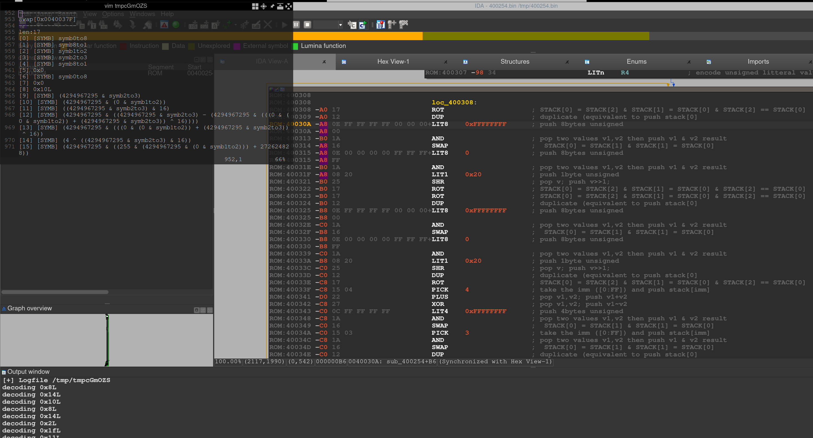

# DWARF support for IDA PRO & Ghidra

Fichiers associés à l'article "Méthodologie d'implémentation d'une architecture sur IDA PRO et Ghidra" paru dans le HS 21 MISC de Janvier 2020, finalement disponible en Juillet 2020. 

Les fichiers ont été développés et testés sur la version 7.3 de IDA PRO et 9.0.2 de Ghidra.

##Installation 

cf. indications dans l'article

##TODO 

Ajouter support des branchements (in)conditionnels dans l'émulateur IDA PRO
Ajouter heuristiques pour simplifier les expressions  
Ajouter support z3 

##Bogues :

Le processeur ne fonctionne pas sur la version >= 7.4 de IDA PRO, c'est en cours d'investigation -\_(-_+)_/- ...
L'instruction LIT8 ne fonctionne pas correctement sur IDA PRO. 

## Rendus graphiques 

